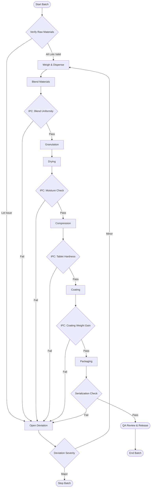

## Possible Failures by BPM Checkpoint

### 1) Verify Raw Materials
- Wrong material code or lot selected for the batch.
- COA missing, expired, or not QA approved.
- Material lot expired or near expiry beyond policy window.
- Container seal broken, damaged, or contamination signs observed.
- Quantity on hand does not match required BOM amount.
- Material status mismatch between warehouse and MES (for example, blocked in ERP but available in MES).

### 2) Deviation Severity Assessment
- Severity misclassified (minor entered as major or vice versa).
- Required QA review missing before disposition.
- CAPA not opened for recurring or systemic issue.
- Batch restarted before deviation closure criteria are met.
- Incomplete deviation narrative (root cause and impact not documented).

### 3) IPC: Blend Uniformity
- Assay variation outside blend uniformity limits.
- Sampling location or method incorrect.
- Blender runtime or RPM outside validated range.
- Blend segregation due to hold time or transfer delay.
- Instrument calibration out of date.

### 4) IPC: Moisture Check (Post-Drying)
- Residual moisture above upper limit (under-dried granules).
- Residual moisture below lower limit (over-dried granules).
- Uneven drying due to airflow or load distribution problems.
- Moisture analyzer drift or calibration failure.
- Sample not representative of batch bulk.

### 5) IPC: Tablet Hardness (Compression)
- Hardness below lower spec causing friability risk.
- Hardness above upper spec causing dissolution risk.
- Compression force fluctuations from feeder inconsistency.
- Tooling wear or punch damage affecting tablet quality.
- Tablet weight variation driving hardness variability.

### 6) IPC: Coating Weight Gain
- Coating gain below target (insufficient coverage).
- Coating gain above target (overcoating, dissolution impact).
- Spray rate or atomization pressure out of range.
- Inlet/outlet air temperature outside validated range.
- Coating defects (sticking, peeling, orange peel, color non-uniformity).

### 7) Serialization Check
- Duplicate serial numbers generated.
- Missing serials or gaps in sequence outside tolerance.
- GTIN mismatch with product/batch master data.
- Vision system read failures or high reject rate.
- Aggregation hierarchy mismatch (unit, bundle, case, pallet).
- Serialization data not transmitted to repository or downstream systems.

### 8) QA Review and Release
- Open critical/major deviations at release time.
- Failed IPC result not fully investigated or dispositioned.
- Missing executed batch record fields or signatures.
- Reconciliation mismatch (input materials vs output yield).
- Environmental monitoring excursion not assessed for impact.
- Manual data correction performed without approved change control or audit trail.