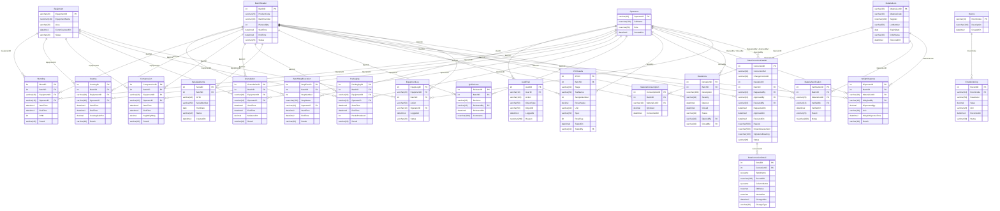

```mermaid
erDiagram

    %% =========================
    %% Core Reference Tables
    %% =========================
    Operators {
        varchar(10) OperatorID PK
        nvarchar(100) FullName
        nvarchar(50) Role
        datetime2 CreatedOn
    }

    Equipment {
        varchar(20) EquipmentID PK
        nvarchar(100) EquipmentName
        varchar(20) Area
        datetime2 CommissionedOn
        varchar(20) Status
    }

    Rooms {
        varchar(10) RoomCode PK
        nvarchar(100) Description
        datetime2 CreatedOn
    }

    MaterialLots {
        varchar(20) MaterialLotID PK
        varchar(20) MaterialCode
        nvarchar(100) Supplier
        varchar(50) LotNumber
        date ExpiryDate
        varchar(20) COAStatus
        datetime2 ReceivedOn
    }

    %% =========================
    %% Batch & Execution Tables
    %% =========================
    BatchHeader {
        int BatchID PK
        varchar(20) ProductCode
        varchar(30) BatchNumber
        int PlannedQty
        datetime2 StartTime
        datetime2 EndTime
        varchar(20) Status
    }

    BatchStepExecution {
        int StepExecID PK
        int BatchID FK
        int StepNumber
        nvarchar(100) StepName
        varchar(10) OperatorID FK
        datetime2 StartTime
        datetime2 EndTime
        varchar(20) Result
    }

    Blending {
        int BlendID PK
        int BatchID FK
        varchar(20) EquipmentID FK
        varchar(10) OperatorID FK
        datetime2 StartTime
        datetime2 EndTime
        int RPM
        varchar(20) Result
    }

    Coating {
        int CoatingID PK
        int BatchID FK
        varchar(20) EquipmentID FK
        varchar(10) OperatorID FK
        datetime2 StartTime
        datetime2 EndTime
        decimal CoatingGainPct
        varchar(20) Result
    }

    Compression {
        int CompressionID PK
        int BatchID FK
        varchar(20) EquipmentID FK
        varchar(10) OperatorID FK
        datetime2 StartTime
        datetime2 EndTime
        decimal AvgWeightMg
        varchar(20) Result
    }

    Granulation {
        int GranulationID PK
        int BatchID FK
        varchar(20) EquipmentID FK
        varchar(10) OperatorID FK
        datetime2 StartTime
        datetime2 EndTime
        decimal MoisturePct
        varchar(20) Result
    }

    Packaging {
        int PackagingID PK
        int BatchID FK
        varchar(20) EquipmentID FK
        varchar(10) OperatorID FK
        datetime2 StartTime
        datetime2 EndTime
        int PacksProduced
        varchar(20) Result
    }

    SerializedUnits {
        int SerialID PK
        int BatchID FK
        varchar(20) GTIN
        varchar(50) SerialNumber
        date PackDate
        varchar(20) Status
        datetime2 CreatedOn
    }

    QARelease {
        int ReleaseID PK
        int BatchID FK
        varchar(20) Decision
        varchar(10) ReleasedBy FK
        datetime2 ReleasedOn
        nvarchar(200) Comments
    }

    %% =========================
    %% Material & IPC Tables
    %% =========================
    MaterialConsumption {
        int ConsumptionID PK
        int BatchID FK
        varchar(20) MaterialLotID FK
        decimal QtyUsed
        datetime2 ConsumedOn
    }

    MaterialVerification {
        int VerificationID PK
        int BatchID FK
        varchar(20) MaterialLotID FK
        varchar(10) VerifiedBy FK
        datetime2 VerifiedOn
        varchar(20) Result
        nvarchar(200) Notes
    }

    WeighDispense {
        int DispenseID PK
        int BatchID FK
        varchar(20) MaterialLotID FK
        varchar(10) WeighedBy FK
        decimal DispensedQty
        varchar(20) Unit
        datetime2 WeighDispenseTime
        varchar(20) Result
    }

    IPCResults {
        int IPCID PK
        int BatchID FK
        varchar(30) Stage
        varchar(50) TestName
        int SampleNumber
        decimal ResultValue
        varchar(20) Unit
        varchar(50) Spec
        bit PassFlag
        datetime2 TestedOn
        varchar(10) TestedBy FK
    }

    %% =========================
    %% Audit, Deviations, Corrections
    %% =========================
    AuditTrail {
        int AuditID PK
        varchar(10) UserID FK
        varchar(100) Action
        varchar(50) ObjectType
        varchar(50) ObjectID
        datetime2 LoggedAt
        nvarchar(200) Reason
    }

    Deviations {
        int DeviationID PK
        int BatchID FK
        nvarchar(200) Description
        varchar(20) Severity
        datetime2 Opened
        datetime2 Closed
        varchar(20) Status
        varchar(10) OpenedBy FK
        varchar(10) ClosedBy FK
    }

    DataCorrectionHeader {
        int CorrectionID PK
        varchar(30) CorrectionRef
        varchar(30) ChangeControlID
        int DeviationID
        int BatchID FK
        varchar(10) RequestedBy FK
        varchar(10) ApprovedBy FK
        varchar(10) ExecutedBy FK
        datetime2 RequestedOn
        datetime2 ApprovedOn
        datetime2 ExecutedOn
        nvarchar(500) Reason
        nvarchar(500) ImpactAssessment
        nvarchar(100) SignatureMeaning
        varchar(20) Status
    }

    DataCorrectionDetail {
        int DetailID PK
        int CorrectionID FK
        sysname TableName
        nvarchar(100) RecordPK
        sysname ColumnName
        nvarchar OldValue
        nvarchar NewValue
        datetime2 ChangedOn
        varchar(20) ChangeType
    }

    EnvMonitoring {
        int RecordID PK
        varchar(10) RoomCode FK
        varchar(50) Parameter
        decimal Value
        varchar(20) Unit
        datetime2 RecordedAt
        varchar(30) Status
    }

    EquipmentLog {
        int EquipLogID PK
        varchar(20) EquipmentID FK
        int BatchID FK
        varchar(50) Action
        varchar(10) OperatorID FK
        datetime2 LoggedAt
        varchar(20) Status
    }

    %% =========================
    %% Relationships
    %% =========================

    BatchHeader ||--o{ BatchStepExecution : "BatchID"
    BatchHeader ||--o{ Blending : "BatchID"
    BatchHeader ||--o{ Coating : "BatchID"
    BatchHeader ||--o{ Compression : "BatchID"
    BatchHeader ||--o{ Granulation : "BatchID"
    BatchHeader ||--o{ Packaging : "BatchID"
    BatchHeader ||--o{ SerializedUnits : "BatchID"
    BatchHeader ||--o{ QARelease : "BatchID"
    BatchHeader ||--o{ MaterialConsumption : "BatchID"
    BatchHeader ||--o{ MaterialVerification : "BatchID"
    BatchHeader ||--o{ WeighDispense : "BatchID"
    BatchHeader ||--o{ IPCResults : "BatchID"
    BatchHeader ||--o{ Deviations : "BatchID"
    BatchHeader ||--o{ DataCorrectionHeader : "BatchID"
    BatchHeader ||--o{ EquipmentLog : "BatchID"

    Operators ||--o{ AuditTrail : "UserID"
    Operators ||--o{ BatchStepExecution : "OperatorID"
    Operators ||--o{ Blending : "OperatorID"
    Operators ||--o{ Coating : "OperatorID"
    Operators ||--o{ Compression : "OperatorID"
    Operators ||--o{ Granulation : "OperatorID"
    Operators ||--o{ Packaging : "OperatorID"
    Operators ||--o{ QARelease : "ReleasedBy"
    Operators ||--o{ IPCResults : "TestedBy"
    Operators ||--o{ MaterialVerification : "VerifiedBy"
    Operators ||--o{ WeighDispense : "WeighedBy"
    Operators ||--o{ Deviations : "OpenedBy / ClosedBy"
    Operators ||--o{ DataCorrectionHeader : "RequestedBy / ApprovedBy / ExecutedBy"
    Operators ||--o{ EquipmentLog : "OperatorID"

    Equipment ||--o{ Blending : "EquipmentID"
    Equipment ||--o{ Coating : "EquipmentID"
    Equipment ||--o{ Compression : "EquipmentID"
    Equipment ||--o{ Granulation : "EquipmentID"
    Equipment ||--o{ Packaging : "EquipmentID"
    Equipment ||--o{ EquipmentLog : "EquipmentID"

    MaterialLots ||--o{ MaterialConsumption : "MaterialLotID"
    MaterialLots ||--o{ MaterialVerification : "MaterialLotID"
    MaterialLots ||--o{ WeighDispense : "MaterialLotID"

    Rooms ||--o{ EnvMonitoring : "RoomCode"

    DataCorrectionHeader ||--o{ DataCorrectionDetail : "CorrectionID"
```
